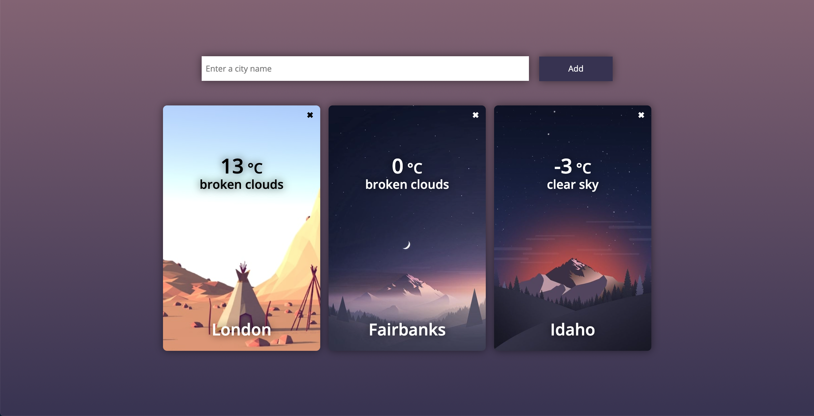

# Flask Weather App

This is a small Weather Web App using Flask. The app is based on the JetBrains Academy track of the same name and uses
the [OpenWeatherMap API](https://openweathermap.org/api). The data is pulled from the API and displayed in the browser.
To store the data the app uses a SQLite database.



## Installation

- Clone this repository:

```sh
git clone github.com/dan-koller/Flask-Weather-App
```

- Navigate to the directory:

```sh
cd Flask-Weather-App
```

- Create a local environment:

```sh
virtualenv venv
```

- Install the dependencies:

```sh
pip install -r requirements.txt
```

## Configuration

- Paste your API key into the app.py file. You can get your API key from
  the [OpenWeatherMap API](https://openweathermap.org/api).

```python3
OPENWEATHERMAP_API_KEY = '<your_api_key>'
```

- The app currently runs in debug mode. Remove if you want to run in production.

## Run the app

- Go to the `src` directory and run the following command:

```sh
python3 app.py
```

## Stack

- Python3
- Flask
- OpenWeatherMap API
- SQLite3
